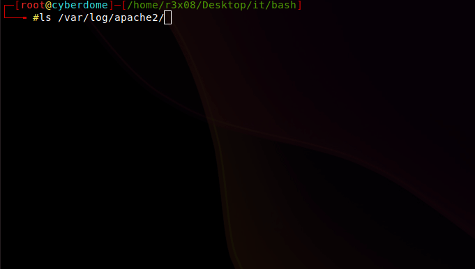

# cl3aner
Bash script for deleting log files.
> Script works with root privileges!
# Install 
apt install git -y && git clone https://github.com/r3x08/cl3aner && cd cl3aner/ && chmod +x cleaner.sh
# Usage
**bash clearner.sh**  
# 
